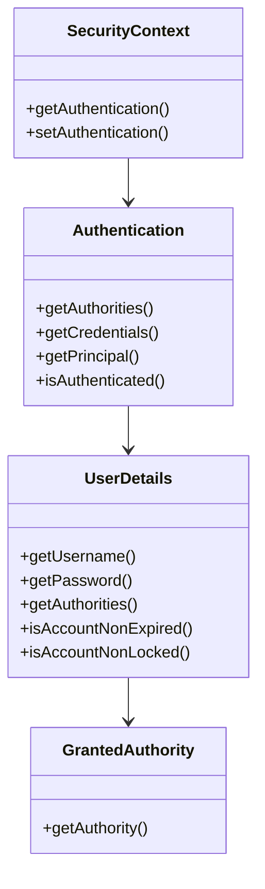

# Guia Definitivo Spring Security

## Índice
- [1. Introdução](#1-introdução)
  - [1.1 Visão Geral do Spring Security](#11-visão-geral-do-spring-security)
  - [1.2 Importância da Segurança](#12-importância-da-segurança)
  - [1.3 Conceitos Fundamentais](#13-conceitos-fundamentais)
- [2. Fundamentos da Implementação](#2-fundamentos-da-implementação)
  - [2.1 Configuração Básica](#21-configuração-básica)
  - [2.2 Dependências Necessárias](#22-dependências-necessárias)
  - [2.3 Estrutura de Classes](#23-estrutura-de-classes)

## 1. Introdução

### 1.1 Visão Geral do Spring Security

O Spring Security é um framework poderoso e altamente customizável de autenticação e controle de acesso. É o padrão de facto para segurança em aplicações Spring, oferecendo proteção abrangente contra ameaças como:

- Injeção de SQL
- Cross-site scripting (XSS)
- Cross-site request forgery (CSRF)
- Session fixation
- Clickjacking

### 1.2 Importância da Segurança

Em um cenário onde ciberataques são cada vez mais sofisticados, a segurança tornou-se um requisito crítico para qualquer aplicação moderna. Algumas estatísticas importantes:

- 43% dos ataques cibernéticos visam pequenas empresas
- 94% dos malwares são entregues por email
- O custo médio de uma violação de dados é de $3.86 milhões

### 1.3 Conceitos Fundamentais

#### Authentication (Autenticação)
Processo de verificar a identidade de um usuário, sistema ou dispositivo.

```java
public interface Authentication extends Principal, Serializable {
    Collection<? extends GrantedAuthority> getAuthorities();
    Object getCredentials();
    Object getDetails();
    Object getPrincipal();
    boolean isAuthenticated();
    void setAuthenticated(boolean isAuthenticated);
}
```

#### Authorization (Autorização)
Processo de determinar se um usuário autenticado tem permissão para acessar um recurso específico.

#### Principal
Representa o usuário autenticado atual.

```java
SecurityContext context = SecurityContextHolder.getContext();
Authentication authentication = context.getAuthentication();
String username = authentication.getName();
```

#### GrantedAuthority
Representa uma permissão concedida ao Principal.

## 2. Fundamentos da Implementação

### 2.1 Configuração Básica

```java
@Configuration
@EnableWebSecurity
public class SecurityConfig {
    
    @Bean
    public SecurityFilterChain filterChain(HttpSecurity http) throws Exception {
        http
            .authorizeHttpRequests((authz) -> authz
                .requestMatchers("/public/**").permitAll()
                .anyRequest().authenticated()
            )
            .formLogin(form -> form
                .loginPage("/login")
                .permitAll()
            )
            .logout(logout -> logout
                .logoutSuccessUrl("/")
            );
        
        return http.build();
    }
    
    @Bean
    public PasswordEncoder passwordEncoder() {
        return new BCryptPasswordEncoder();
    }
}
```

### 2.2 Dependências Necessárias

```xml
<!-- pom.xml -->
<dependencies>
    <dependency>
        <groupId>org.springframework.boot</groupId>
        <artifactId>spring-boot-starter-security</artifactId>
    </dependency>
    
    <dependency>
        <groupId>org.springframework.security</groupId>
        <artifactId>spring-security-test</artifactId>
        <scope>test</scope>
    </dependency>
</dependencies>
```

### 2.3 Estrutura de Classes



#### Classes Principais:

1. **SecurityContextHolder**
   - Armazena os detalhes do usuário autenticado
   - Utiliza ThreadLocal para manter o contexto

2. **UserDetailsService**
   - Interface para recuperar dados do usuário
   - Implementação personalizada para integração com banco de dados

```java
@Service
public class CustomUserDetailsService implements UserDetailsService {
    
    @Autowired
    private UserRepository userRepository;
    
    @Override
    public UserDetails loadUserByUsername(String username) 
            throws UsernameNotFoundException {
        User user = userRepository.findByUsername(username)
            .orElseThrow(() -> new UsernameNotFoundException(
                "Usuário não encontrado: " + username));
        
        return new CustomUserDetails(user);
    }
}
```

3. **SecurityFilterChain**
   - Define a cadeia de filtros de segurança
   - Configura regras de autorização e autenticação

> **Nota**: Esta é a primeira parte do guia. Aguardo sua confirmação para prosseguir com as próximas seções, que abordarão autenticação baseada em banco de dados, gestão de autorização e implementações específicas por arquitetura.
