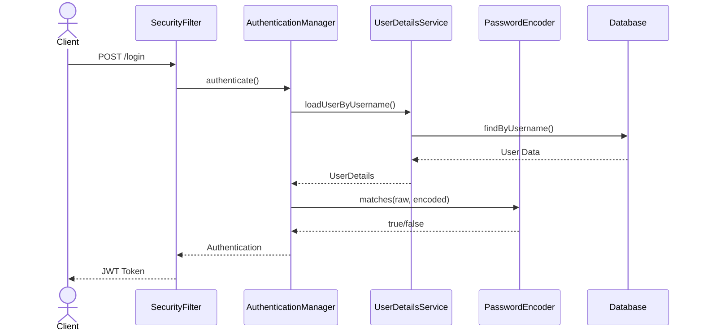

# 3. Autenticação Baseada em Banco de Dados

## 3.1 Modelagem de Entidades

### User Entity
```java
@Entity
@Table(name = "users")
public class User {
    @Id
    @GeneratedValue(strategy = GenerationType.IDENTITY)
    private Long id;

    @Column(unique = true, nullable = false)
    private String username;

    @Column(nullable = false)
    private String password;

    @Column(nullable = false)
    private String email;

    @ManyToMany(fetch = FetchType.EAGER)
    @JoinTable(
        name = "user_roles",
        joinColumns = @JoinColumn(name = "user_id"),
        inverseJoinColumns = @JoinColumn(name = "role_id")
    )
    private Set<Role> roles = new HashSet<>();
}
```

### Role Entity
```java
@Entity
@Table(name = "roles")
public class Role {
    @Id
    @GeneratedValue(strategy = GenerationType.IDENTITY)
    private Long id;

    @Column(unique = true, nullable = false)
    private String name;

    @ManyToMany(mappedBy = "roles")
    private Set<User> users = new HashSet<>();

    @ManyToMany(fetch = FetchType.EAGER)
    @JoinTable(
        name = "role_permissions",
        joinColumns = @JoinColumn(name = "role_id"),
        inverseJoinColumns = @JoinColumn(name = "permission_id")
    )
    private Set<Permission> permissions = new HashSet<>();
}
```

### Permission Entity
```java
@Entity
@Table(name = "permissions")
public class Permission {
    @Id
    @GeneratedValue(strategy = GenerationType.IDENTITY)
    private Long id;

    @Column(unique = true, nullable = false)
    private String name;

    @ManyToMany(mappedBy = "permissions")
    private Set<Role> roles = new HashSet<>();
}
```

## 3.2 Scripts SQL e Migrations

```sql
-- V1__create_security_tables.sql
CREATE TABLE users (
    id BIGSERIAL PRIMARY KEY,
    username VARCHAR(50) NOT NULL UNIQUE,
    password VARCHAR(255) NOT NULL,
    email VARCHAR(100) NOT NULL,
    enabled BOOLEAN DEFAULT TRUE
);

CREATE TABLE roles (
    id BIGSERIAL PRIMARY KEY,
    name VARCHAR(50) NOT NULL UNIQUE
);

CREATE TABLE permissions (
    id BIGSERIAL PRIMARY KEY,
    name VARCHAR(50) NOT NULL UNIQUE
);

CREATE TABLE user_roles (
    user_id BIGINT REFERENCES users(id),
    role_id BIGINT REFERENCES roles(id),
    PRIMARY KEY (user_id, role_id)
);

CREATE TABLE role_permissions (
    role_id BIGINT REFERENCES roles(id),
    permission_id BIGINT REFERENCES permissions(id),
    PRIMARY KEY (role_id, permission_id)
);

-- V2__insert_initial_data.sql
INSERT INTO roles (name) VALUES 
('ROLE_ADMIN'), 
('ROLE_USER'), 
('ROLE_MANAGER');

INSERT INTO permissions (name) VALUES 
('READ'), 
('WRITE'), 
('DELETE'), 
('ADMIN');
```

## 3.3 Implementação do UserDetailsService

```java
@Service
@Transactional
public class CustomUserDetailsService implements UserDetailsService {

    @Autowired
    private UserRepository userRepository;

    @Override
    public UserDetails loadUserByUsername(String username) 
            throws UsernameNotFoundException {
        User user = userRepository.findByUsername(username)
            .orElseThrow(() -> new UsernameNotFoundException(
                "Usuário não encontrado: " + username));

        return new org.springframework.security.core.userdetails.User(
            user.getUsername(),
            user.getPassword(),
            user.isEnabled(),
            true, // accountNonExpired
            true, // credentialsNonExpired
            true, // accountNonLocked
            getAuthorities(user.getRoles())
        );
    }

    private Collection<? extends GrantedAuthority> getAuthorities(Set<Role> roles) {
        return roles.stream()
            .flatMap(role -> {
                Set<GrantedAuthority> authorities = new HashSet<>();
                authorities.add(new SimpleGrantedAuthority(role.getName()));
                role.getPermissions().stream()
                    .map(p -> new SimpleGrantedAuthority(p.getName()))
                    .forEach(authorities::add);
                return authorities.stream();
            })
            .collect(Collectors.toSet());
    }
}
```

## 3.4 Implementação do PasswordEncoder

```java
@Configuration
public class PasswordEncoderConfig {

    @Bean
    public PasswordEncoder passwordEncoder() {
        return new BCryptPasswordEncoder(12);
    }
}

// Serviço de registro de usuário
@Service
@Transactional
public class UserService {

    @Autowired
    private UserRepository userRepository;

    @Autowired
    private PasswordEncoder passwordEncoder;

    public User registerNewUser(UserRegistrationDTO registrationDTO) {
        // Validar se usuário já existe
        if (userRepository.findByUsername(registrationDTO.getUsername()).isPresent()) {
            throw new UserAlreadyExistsException("Username já está em uso");
        }

        User user = new User();
        user.setUsername(registrationDTO.getUsername());
        user.setEmail(registrationDTO.getEmail());
        user.setPassword(passwordEncoder.encode(registrationDTO.getPassword()));
        
        // Adicionar role padrão
        Role userRole = roleRepository.findByName("ROLE_USER")
            .orElseThrow(() -> new RoleNotFoundException("Role padrão não encontrada"));
        user.getRoles().add(userRole);

        return userRepository.save(user);
    }
}
```

# 4. Gestão de Autorização

## 4.1 Role-Based Access Control (RBAC)

### Configuração de Segurança com RBAC

```java
@Configuration
@EnableWebSecurity
@EnableMethodSecurity
public class SecurityConfig {

    @Bean
    public SecurityFilterChain filterChain(HttpSecurity http) throws Exception {
        http
            .authorizeHttpRequests(authz -> authz
                .requestMatchers("/api/public/**").permitAll()
                .requestMatchers("/api/admin/**").hasRole("ADMIN")
                .requestMatchers("/api/manager/**").hasAnyRole("ADMIN", "MANAGER")
                .requestMatchers(HttpMethod.POST, "/api/**").hasAuthority("WRITE")
                .requestMatchers(HttpMethod.DELETE, "/api/**").hasAuthority("DELETE")
                .anyRequest().authenticated()
            )
            .sessionManagement(session -> session
                .sessionCreationPolicy(SessionCreationPolicy.STATELESS)
            )
            .csrf(csrf -> csrf.disable())
            .addFilterBefore(jwtAuthenticationFilter(), 
                UsernamePasswordAuthenticationFilter.class);

        return http.build();
    }
}
```

## 4.2 Method Security

```java
@RestController
@RequestMapping("/api/users")
public class UserController {

    @PreAuthorize("hasRole('ADMIN')")
    @GetMapping("/admin/all")
    public List<UserDTO> getAllUsers() {
        // ...
    }

    @PreAuthorize("hasAuthority('WRITE')")
    @PostMapping
    public UserDTO createUser(@RequestBody UserDTO userDTO) {
        // ...
    }

    @PreAuthorize("#username == authentication.principal.username or hasRole('ADMIN')")
    @GetMapping("/{username}")
    public UserDTO getUser(@PathVariable String username) {
        // ...
    }

    @PostAuthorize("returnObject.username == authentication.principal.username")
    @GetMapping("/{id}/profile")
    public UserProfile getUserProfile(@PathVariable Long id) {
        // ...
    }
}
```

## 4.3 Expression-based Access Control

```java
@Service
public class DocumentService {

    @PreAuthorize("hasPermission(#document, 'READ') or hasRole('ADMIN')")
    public Document readDocument(Document document) {
        // ...
    }

    @PostFilter("hasPermission(filterObject, 'READ')")
    public List<Document> getAllDocuments() {
        // ...
    }
}
```

### Implementação de Custom Permission Evaluator

```java
@Component
public class CustomPermissionEvaluator implements PermissionEvaluator {

    @Override
    public boolean hasPermission(Authentication authentication, 
            Object targetDomainObject, Object permission) {
        if ((authentication == null) || (targetDomainObject == null)) {
            return false;
        }

        String targetType = targetDomainObject.getClass().getSimpleName().toUpperCase();
        return hasPrivilege(authentication, targetType, 
            permission.toString().toUpperCase());
    }

    @Override
    public boolean hasPermission(Authentication authentication, 
            Serializable targetId, String targetType, Object permission) {
        if ((authentication == null) || (targetType == null)) {
            return false;
        }
        return hasPrivilege(authentication, targetType.toUpperCase(), 
            permission.toString().toUpperCase());
    }

    private boolean hasPrivilege(Authentication auth, String targetType, 
            String permission) {
        for (GrantedAuthority grantedAuth : auth.getAuthorities()) {
            if (grantedAuth.getAuthority().startsWith(targetType) && 
                grantedAuth.getAuthority().contains(permission)) {
                return true;
            }
        }
        return false;
    }
}
```



> **Dica de Segurança**: Sempre use BCrypt ou Argon2 para hash de senhas. MD5 e SHA-1 não são seguros para senhas.

> **Nota**: Ao implementar autenticação baseada em banco de dados, certifique-se de usar índices apropriados para campos frequentemente consultados como username e email.
