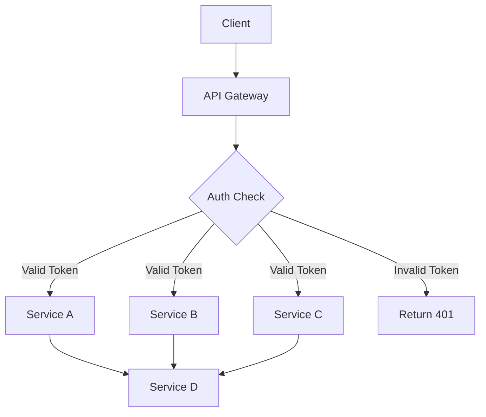

# 5. Implementações por Arquitetura

## 5.1 Aplicações MVC

### Configuração MVC Específica

```java
@Configuration
@EnableWebSecurity
public class MvcSecurityConfig {

    @Bean
    public SecurityFilterChain filterChain(HttpSecurity http) throws Exception {
        http
            .authorizeHttpRequests(authz -> authz
                .requestMatchers("/", "/home", "/css/**", "/js/**").permitAll()
                .requestMatchers("/admin/**").hasRole("ADMIN")
                .anyRequest().authenticated()
            )
            .formLogin(form -> form
                .loginPage("/login")
                .defaultSuccessUrl("/dashboard")
                .failureUrl("/login?error=true")
                .permitAll()
            )
            .rememberMe(remember -> remember
                .key("uniqueAndSecret")
                .tokenValiditySeconds(86400) // 1 dia
                .rememberMeParameter("remember-me")
                .userDetailsService(userDetailsService())
            )
            .sessionManagement(session -> session
                .maximumSessions(1)
                .expiredUrl("/login?expired=true")
            )
            .csrf(csrf -> csrf
                .csrfTokenRepository(CookieCsrfTokenRepository.withHttpOnlyFalse())
            );

        return http.build();
    }
}
```

### Thymeleaf Security Integration

```html
<!-- login.html -->
<!DOCTYPE html>
<html xmlns:th="http://www.thymeleaf.org"
      xmlns:sec="http://www.thymeleaf.org/extras/spring-security">
<head>
    <title>Login</title>
</head>
<body>
    <div th:if="${param.error}">
        Invalid username and password.
    </div>
    <form th:action="@{/login}" method="post">
        <input type="text" name="username"/>
        <input type="password" name="password"/>
        <input type="checkbox" name="remember-me"/> Remember me
        <input type="hidden" th:name="${_csrf.parameterName}" 
               th:value="${_csrf.token}"/>
        <button type="submit">Sign In</button>
    </form>
</body>
</html>
```

### Session Management

```java
@Configuration
public class SessionConfig {

    @Bean
    public HttpSessionEventPublisher httpSessionEventPublisher() {
        return new HttpSessionEventPublisher();
    }
    
    @Bean
    public SessionRegistry sessionRegistry() {
        return new SessionRegistryImpl();
    }
}
```

## 5.2 REST APIs

### JWT Implementation

```java
@Component
public class JwtTokenProvider {
    
    @Value("${jwt.secret}")
    private String jwtSecret;
    
    @Value("${jwt.expiration}")
    private int jwtExpiration;
    
    public String generateToken(Authentication authentication) {
        UserDetails userDetails = (UserDetails) authentication.getPrincipal();
        
        return Jwts.builder()
            .setSubject(userDetails.getUsername())
            .setIssuedAt(new Date())
            .setExpiration(new Date(new Date().getTime() + jwtExpiration))
            .signWith(SignatureAlgorithm.HS512, jwtSecret)
            .compact();
    }
    
    public String getUsernameFromToken(String token) {
        Claims claims = Jwts.parser()
            .setSigningKey(jwtSecret)
            .parseClaimsJws(token)
            .getBody();
        
        return claims.getSubject();
    }
    
    public boolean validateToken(String token) {
        try {
            Jwts.parser().setSigningKey(jwtSecret).parseClaimsJws(token);
            return true;
        } catch (JwtException | IllegalArgumentException e) {
            return false;
        }
    }
}
```

### OAuth2 Configuration

```java
@Configuration
@EnableWebSecurity
public class OAuth2SecurityConfig {

    @Bean
    public SecurityFilterChain filterChain(HttpSecurity http) throws Exception {
        http
            .oauth2Login(oauth2 -> oauth2
                .authorizationEndpoint(authorization -> authorization
                    .baseUri("/oauth2/authorize"))
                .redirectionEndpoint(redirection -> redirection
                    .baseUri("/oauth2/callback/*"))
                .userInfoEndpoint(userInfo -> userInfo
                    .userService(customOAuth2UserService()))
            )
            .oauth2ResourceServer(oauth2 -> oauth2
                .jwt(jwt -> jwt
                    .jwtAuthenticationConverter(jwtAuthenticationConverter())
                )
            );

        return http.build();
    }

    @Bean
    public JwtDecoder jwtDecoder() {
        return NimbusJwtDecoder.withJwkSetUri("${spring.security.oauth2.resourceserver.jwt.jwk-set-uri}")
            .build();
    }
}
```

### Rate Limiting

```java
@Component
public class RateLimitingFilter extends OncePerRequestFilter {

    private final RateLimiter rateLimiter;

    public RateLimitingFilter() {
        this.rateLimiter = RateLimiter.create(10.0); // 10 requests per second
    }

    @Override
    protected void doFilterInternal(HttpServletRequest request,
                                  HttpServletResponse response,
                                  FilterChain filterChain)
            throws ServletException, IOException {
        
        if (!rateLimiter.tryAcquire()) {
            response.setStatus(HttpStatus.TOO_MANY_REQUESTS.value());
            response.getWriter().write("Too many requests");
            return;
        }
        
        filterChain.doFilter(request, response);
    }
}
```

## 5.3 Microserviços

### Service-to-Service Authentication

```java
@Configuration
public class ServiceSecurityConfig {

    @Bean
    public ClientRegistrationRepository clientRegistrationRepository() {
        return new InMemoryClientRegistrationRepository(
            ClientRegistration.withRegistrationId("service-a")
                .clientId("service-a-client")
                .clientSecret("{noop}secret")
                .authorizationGrantType(AuthorizationGrantType.CLIENT_CREDENTIALS)
                .scope("service")
                .tokenUri("http://auth-server/oauth/token")
                .build()
        );
    }

    @Bean
    public OAuth2AuthorizedClientManager authorizedClientManager(
            ClientRegistrationRepository clientRegistrationRepository,
            OAuth2AuthorizedClientRepository authorizedClientRepository) {
        
        OAuth2AuthorizedClientProvider authorizedClientProvider =
            OAuth2AuthorizedClientProviderBuilder.builder()
                .clientCredentials()
                .build();

        DefaultOAuth2AuthorizedClientManager authorizedClientManager =
            new DefaultOAuth2AuthorizedClientManager(
                clientRegistrationRepository, authorizedClientRepository);
        authorizedClientManager.setAuthorizedClientProvider(authorizedClientProvider);

        return authorizedClientManager;
    }
}
```

### Gateway Security

```java
@Configuration
public class GatewaySecurityConfig {

    @Bean
    public SecurityWebFilterChain springSecurityFilterChain(ServerHttpSecurity http) {
        return http
            .authorizeExchange(exchanges -> exchanges
                .pathMatchers("/public/**").permitAll()
                .anyExchange().authenticated()
            )
            .oauth2ResourceServer(oauth2 -> oauth2
                .jwt(withDefaults())
            )
            .csrf(csrf -> csrf.disable())
            .build();
    }

    @Bean
    public ReactiveJwtDecoder jwtDecoder() {
        return ReactiveJwtDecoders.fromIssuerLocation("${spring.security.oauth2.resourceserver.jwt.issuer-uri}");
    }
}
```



### Circuit Breaker Security

```java
@Configuration
public class CircuitBreakerConfig {

    @Bean
    public CircuitBreakerRegistry circuitBreakerRegistry() {
        CircuitBreaker.Settings settings = CircuitBreaker.Settings.builder()
            .failureRateThreshold(50)
            .waitDurationInOpenState(Duration.ofMillis(1000))
            .ringBufferSizeInHalfOpenState(2)
            .ringBufferSizeInClosedState(2)
            .build();

        return CircuitBreakerRegistry.of(settings);
    }
}

@Service
public class SecureService {

    private final CircuitBreaker circuitBreaker;
    private final RestTemplate restTemplate;

    public SecureService(CircuitBreakerRegistry registry) {
        this.circuitBreaker = registry.circuitBreaker("secureService");
        this.restTemplate = new RestTemplate();
    }

    public String secureCall() {
        return circuitBreaker.executeSupplier(() -> {
            ResponseEntity<String> response = restTemplate.exchange(
                "http://secure-service/api",
                HttpMethod.GET,
                new HttpEntity<>(createHeaders()),
                String.class
            );
            return response.getBody();
        });
    }

    private HttpHeaders createHeaders() {
        HttpHeaders headers = new HttpHeaders();
        headers.set("Authorization", "Bearer " + getCurrentToken());
        return headers;
    }
}
```

## 5.4 IoT e Dispositivos

### Device Authentication

```java
@Configuration
public class DeviceAuthenticationConfig {

    @Bean
    public DeviceClientRegistrationRepository deviceClientRegistrationRepository() {
        return new InMemoryDeviceClientRegistrationRepository(
            DeviceClientRegistration.withRegistrationId("iot-device")
                .clientId("device-client")
                .scope("device.read", "device.write")
                .authorizationUri("http://auth-server/device/authorize")
                .tokenUri("http://auth-server/device/token")
                .build()
        );
    }

    @Bean
    public DeviceAuthorizationRequestFilter deviceAuthorizationRequestFilter(
            DeviceClientRegistrationRepository deviceClientRegistrationRepository) {
        return new DeviceAuthorizationRequestFilter(deviceClientRegistrationRepository);
    }
}
```

### Secure MQTT Configuration

```java
@Configuration
public class MqttSecurityConfig {

    @Bean
    public MqttPahoClientFactory mqttClientFactory() {
        DefaultMqttPahoClientFactory factory = new DefaultMqttPahoClientFactory();
        MqttConnectOptions options = new MqttConnectOptions();
        
        options.setUserName("device");
        options.setPassword("secret".toCharArray());
        options.setCleanSession(true);
        
        // SSL/TLS Configuration
        options.setSocketFactory(
            SslContextBuilder.forClient()
                .trustManager(new File("device-trust.jks"))
                .build()
                .newSocket()
        );
        
        factory.setConnectionOptions(options);
        return factory;
    }
}
```

> **Nota de Segurança**: Em ambientes de produção, sempre use certificados SSL/TLS válidos e evite armazenar credenciais no código.

> **Dica**: Para dispositivos IoT, considere implementar um mecanismo de rotação automática de credenciais para maior segurança.
