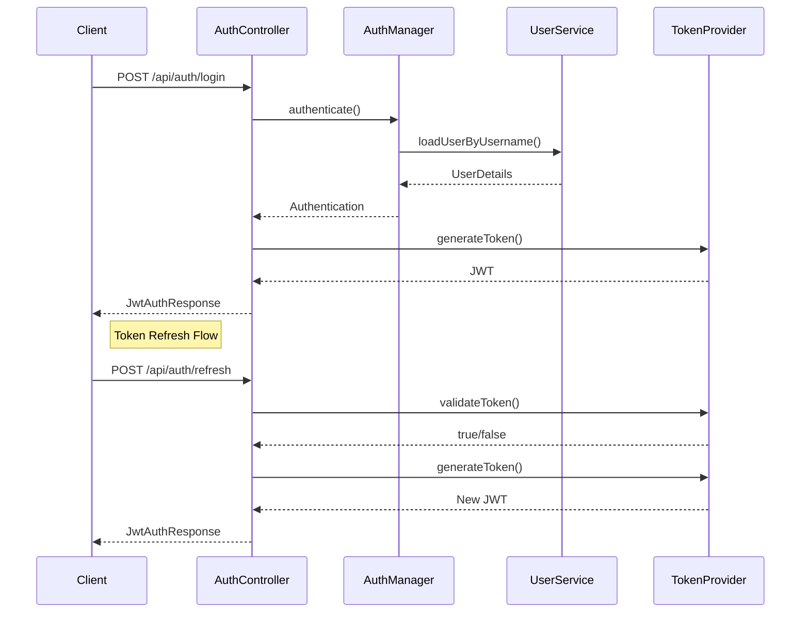

# 6. Boas Práticas e Padrões

## 6.1 Security Headers

```java
@Configuration
public class SecurityHeadersConfig {

    @Bean
    public SecurityFilterChain filterChain(HttpSecurity http) throws Exception {
        http
            .headers(headers -> headers
                .xssProtection(xss -> xss.enable())
                .contentSecurityPolicy(csp -> 
                    csp.policyDirectives("default-src 'self'; frame-ancestors 'none';"))
                .frameOptions(frame -> frame.deny())
                .httpStrictTransportSecurity(hsts -> hsts
                    .includeSubDomains(true)
                    .preload(true)
                    .maxAgeInSeconds(31536000))
                .referrerPolicy(referrer -> 
                    referrer.policy(ReferrerPolicyHeaderWriter.ReferrerPolicy.STRICT_ORIGIN))
                .permissionsPolicy(permissions -> permissions
                    .policy("geolocation=(), camera=(), microphone=()"))
            );
        
        return http.build();
    }
}
```

## 6.2 Password Policies

```java
@Component
public class PasswordValidationService {

    private static final int MIN_LENGTH = 12;
    private static final int MAX_LENGTH = 128;
    private static final Pattern HAS_UPPER = Pattern.compile("[A-Z]");
    private static final Pattern HAS_LOWER = Pattern.compile("[a-z]");
    private static final Pattern HAS_NUMBER = Pattern.compile("\\d");
    private static final Pattern HAS_SPECIAL = Pattern.compile("[!@#$%^&*(),.?\":{}|<>]");
    
    public void validatePassword(String password) {
        List<String> validationErrors = new ArrayList<>();

        if (password.length() < MIN_LENGTH || password.length() > MAX_LENGTH) {
            validationErrors.add("Password must be between " + MIN_LENGTH + 
                " and " + MAX_LENGTH + " characters");
        }
        
        if (!HAS_UPPER.matcher(password).find()) {
            validationErrors.add("Password must contain at least one uppercase letter");
        }
        
        if (!HAS_LOWER.matcher(password).find()) {
            validationErrors.add("Password must contain at least one lowercase letter");
        }
        
        if (!HAS_NUMBER.matcher(password).find()) {
            validationErrors.add("Password must contain at least one number");
        }
        
        if (!HAS_SPECIAL.matcher(password).find()) {
            validationErrors.add("Password must contain at least one special character");
        }
        
        if (!validationErrors.isEmpty()) {
            throw new PasswordValidationException(validationErrors);
        }
    }
}
```

## 6.3 Audit Logging

```java
@Configuration
@EnableJpaAuditing
public class AuditConfig {

    @Bean
    public AuditorAware<String> auditorProvider() {
        return () -> Optional.ofNullable(SecurityContextHolder.getContext())
            .map(SecurityContext::getAuthentication)
            .map(Authentication::getName);
    }
}

@Entity
@EntityListeners(AuditingEntityListener.class)
public class AuditLog {
    @Id
    @GeneratedValue(strategy = GenerationType.IDENTITY)
    private Long id;

    @Column(nullable = false)
    private String event;

    @Column(nullable = false)
    private String resourceType;

    private String resourceId;

    @Column(nullable = false)
    @CreatedDate
    private LocalDateTime timestamp;

    @Column(nullable = false)
    @CreatedBy
    private String username;

    private String ipAddress;

    @Column(length = 1000)
    private String details;
}

@Service
@Transactional
public class SecurityAuditService {
    
    @Autowired
    private AuditLogRepository auditLogRepository;
    
    @Autowired
    private HttpServletRequest request;
    
    public void logSecurityEvent(String event, String resourceType, 
            String resourceId, String details) {
        AuditLog log = new AuditLog();
        log.setEvent(event);
        log.setResourceType(resourceType);
        log.setResourceId(resourceId);
        log.setDetails(details);
        log.setIpAddress(getClientIP());
        
        auditLogRepository.save(log);
    }
    
    private String getClientIP() {
        String xfHeader = request.getHeader("X-Forwarded-For");
        if (xfHeader == null) {
            return request.getRemoteAddr();
        }
        return xfHeader.split(",")[0];
    }
}
```

## 6.4 Multi-factor Authentication

```java
@Configuration
public class MfaConfig {

    @Bean
    public TOTPService totpService() {
        return new DefaultTOTPService();
    }
}

@Service
public class DefaultTOTPService implements TOTPService {
    
    private static final int SECRET_SIZE = 20;
    private static final String ISSUER = "YourApp";
    private static final GoogleAuthenticator gAuth = new GoogleAuthenticator();
    
    @Override
    public String generateSecretKey() {
        SecureRandom random = new SecureRandom();
        byte[] bytes = new byte[SECRET_SIZE];
        random.nextBytes(bytes);
        return Base32.encode(bytes);
    }
    
    @Override
    public String generateQrCodeUri(String username, String secret) {
        return String.format(
            "otpauth://totp/%s:%s?secret=%s&issuer=%s",
            ISSUER,
            username,
            secret,
            ISSUER
        );
    }
    
    @Override
    public boolean validateCode(String secret, int code) {
        return gAuth.authorize(secret, code);
    }
}

@RestController
@RequestMapping("/api/mfa")
public class MfaController {

    @Autowired
    private TOTPService totpService;
    
    @Autowired
    private UserService userService;
    
    @PostMapping("/setup")
    @PreAuthorize("isAuthenticated()")
    public MfaSetupResponse setupMfa() {
        String username = SecurityContextHolder.getContext()
            .getAuthentication().getName();
        
        String secret = totpService.generateSecretKey();
        String qrCodeUri = totpService.generateQrCodeUri(username, secret);
        
        userService.saveMfaSecret(username, secret);
        
        return new MfaSetupResponse(secret, qrCodeUri);
    }
    
    @PostMapping("/verify")
    @PreAuthorize("isAuthenticated()")
    public void verifyMfa(@RequestBody MfaVerificationRequest request) {
        String username = SecurityContextHolder.getContext()
            .getAuthentication().getName();
        String secret = userService.getMfaSecret(username);
        
        if (!totpService.validateCode(secret, request.getCode())) {
            throw new InvalidMfaCodeException("Invalid MFA code");
        }
    }
}
```

# 7. Exemplos Práticos

## 7.1 Exemplo Completo de Autenticação JWT

```java
@RestController
@RequestMapping("/api/auth")
public class AuthController {

    @Autowired
    private AuthenticationManager authenticationManager;
    
    @Autowired
    private JwtTokenProvider tokenProvider;
    
    @Autowired
    private UserService userService;
    
    @PostMapping("/login")
    public ResponseEntity<?> login(@RequestBody LoginRequest loginRequest) {
        try {
            Authentication authentication = authenticationManager.authenticate(
                new UsernamePasswordAuthenticationToken(
                    loginRequest.getUsername(),
                    loginRequest.getPassword()
                )
            );
            
            SecurityContextHolder.getContext()
                .setAuthentication(authentication);
            
            String jwt = tokenProvider.generateToken(authentication);
            
            return ResponseEntity.ok(new JwtAuthResponse(jwt));
            
        } catch (AuthenticationException e) {
            return ResponseEntity
                .status(HttpStatus.UNAUTHORIZED)
                .body(new ApiError("Invalid username or password"));
        }
    }
    
    @PostMapping("/refresh")
    public ResponseEntity<?> refreshToken(
            @RequestHeader("Authorization") String bearerToken) {
        try {
            String token = bearerToken.substring(7);
            if (tokenProvider.validateToken(token)) {
                String username = tokenProvider.getUsernameFromToken(token);
                UserDetails userDetails = userService
                    .loadUserByUsername(username);
                
                String newToken = tokenProvider.generateToken(
                    new UsernamePasswordAuthenticationToken(
                        userDetails,
                        null,
                        userDetails.getAuthorities()
                    )
                );
                
                return ResponseEntity.ok(new JwtAuthResponse(newToken));
            }
            
            return ResponseEntity
                .status(HttpStatus.UNAUTHORIZED)
                .body(new ApiError("Invalid token"));
            
        } catch (Exception e) {
            return ResponseEntity
                .status(HttpStatus.UNAUTHORIZED)
                .body(new ApiError("Token refresh failed"));
        }
    }
}
```

## 7.2 Testes de Segurança

```java
@SpringBootTest
@AutoConfigureMockMvc
public class SecurityTests {

    @Autowired
    private MockMvc mockMvc;
    
    @Autowired
    private UserRepository userRepository;
    
    @Autowired
    private PasswordEncoder passwordEncoder;
    
    @Test
    @WithMockUser(roles = "USER")
    public void whenUserAccessUserEndpoint_thenSuccess() throws Exception {
        mockMvc.perform(get("/api/user/profile"))
            .andExpect(status().isOk());
    }
    
    @Test
    @WithMockUser(roles = "USER")
    public void whenUserAccessAdminEndpoint_thenForbidden() throws Exception {
        mockMvc.perform(get("/api/admin/users"))
            .andExpect(status().isForbidden());
    }
    
    @Test
    public void whenInvalidLogin_thenUnauthorized() throws Exception {
        LoginRequest loginRequest = new LoginRequest(
            "invalid_user",
            "invalid_password"
        );
        
        mockMvc.perform(post("/api/auth/login")
                .contentType(MediaType.APPLICATION_JSON)
                .content(new ObjectMapper().writeValueAsString(loginRequest)))
            .andExpect(status().isUnauthorized());
    }
}
```



> **Dicas de Segurança:**
> 1. Sempre use HTTPS em produção
> 2. Implemente rate limiting para endpoints sensíveis
> 3. Monitore tentativas de login malsucedidas
> 4. Mantenha logs de auditoria detalhados
> 5. Implemente uma política de senhas forte
> 6. Use tokens com tempo de expiração curto
> 7. Implemente autenticação em duas etapas para usuários privilegiados

> **Troubleshooting Comum:**
> 1. Erro 403: Verifique as roles e authorities do usuário
> 2. Token inválido: Verifique a expiração e assinatura
> 3. CORS: Configure adequadamente os headers permitidos
> 4. Session timeout: Ajuste o tempo de expiração da sessão
> 5. Remember-me não funciona: Verifique a configuração do cookie
